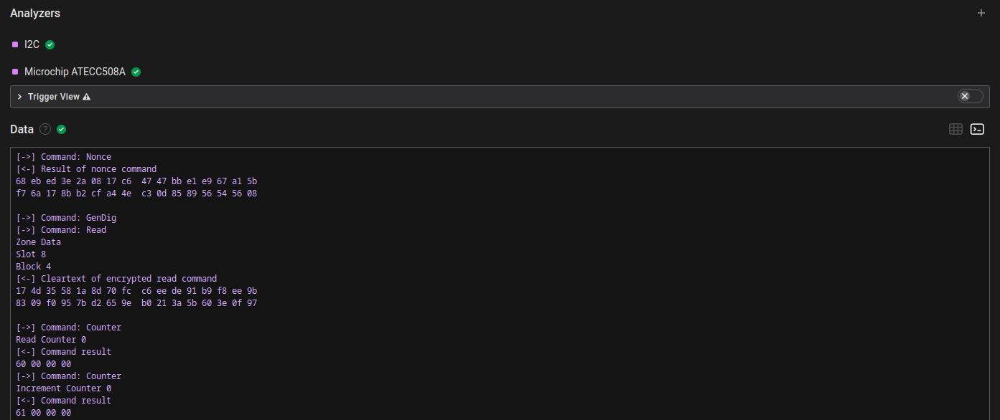
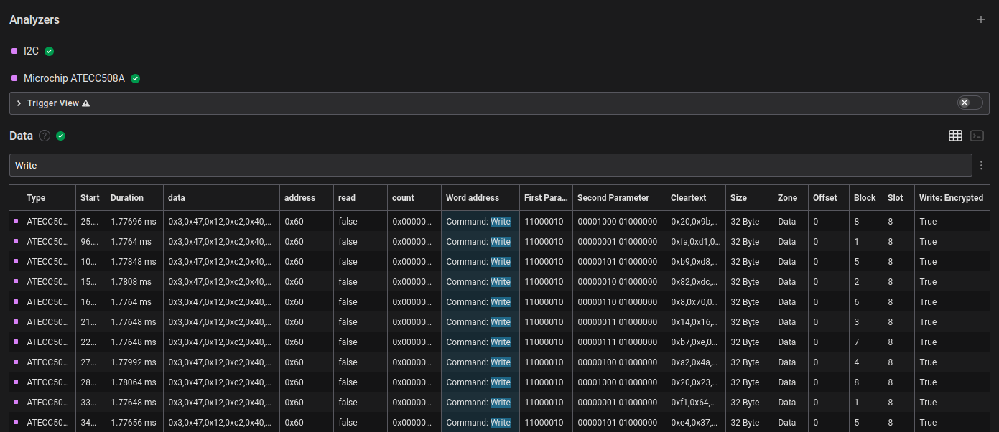

# Microchip ATECC508A
  
This is a HighLevelAnalyzer Extension for Saleae Logic2 to decode I2C messages sent to and from the CryptoAuthentication Device [ATECC508A](https://ww1.microchip.com/downloads/aemDocuments/documents/OTH/ProductDocuments/DataSheets/20005928A.pdf) from Microchip.

This extension is parsing the I2C communication for the ATECC508A. If the read and write commands are using the built in XOR encryption it is also encrypting and decrypting the content.

Example results are printed to the Terminal view and the Data Table.
 

## Usage
Choose the I2C Input Analyzer applied to your ATECC508A I2C communication.

If encryption is used, insert the 32 Bytes I2C read key and the 32 Bytes I2C write key in the settings as hex string.

## Limitations
Not all functions of the chip are implemented in the Extension. The focus was on the decryption of the read and write commands and getting an overview over the communication.